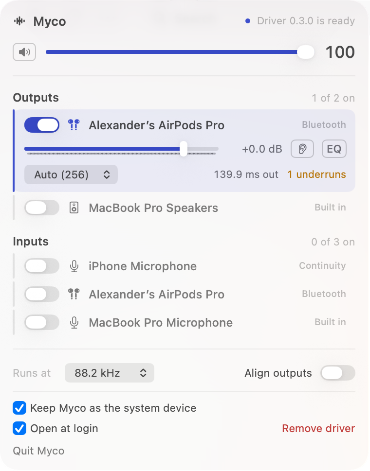

<div align="center">


# Myco

**One audio stream to every speaker, every microphone into one input**

[](https://github.com/ssankko/myco/actions/workflows/ci.yml)
[](https://github.com/ssankko/myco/releases)
[](LICENSE)


<p align="center">
  
</p>

</div>

## What can it do?

Myco is a menu bar app that streams macOS audio to multiple output devices at the same time, and mixes multiple microphones into one input device. Each output has its own volume, delay, buffer size and ten-band EQ.

The motivation was comfortable gaming for me and a comfortable watching experience for my wife. On a call with friends, microphone echo becomes a real problem, and the best fix is headphones, so echo never appears. But with headphones on, my wife cannot hear the game audio, and that is no fun.

The first solution was a macOS aggregate device from Audio MIDI Setup, but it is neither ergonomic nor easy to use. I also tried PolySound, but it rebuilds the aggregate device on every AirPods reconnect, which makes Wine lose track of where to send audio, and taking the AirPods off means reloading the whole game for it to find everything again.

The other problem Myco solves is mic monitoring. In isolating headphones I hear my friends on the call but not my wife speaking next to me. Myco monitors my microphone inputs, so I hear everything said around me.

To achieve all of this, Myco publishes two virtual devices through its own audio driver and does the routing itself, so devices never disappear and the game never notices a change when you tweak your audio setup.

## Features

- **Many outputs at once.** Turn on any set of devices; each gets a volume, a delay, a buffer size and an EQ of its own.
- **Aligned outputs.** One switch delays every output to the slowest one, so speakers and headphones stay in time for pleasant media watching experience.
- **One microphone from many.** Turn on the microphones you want, set each gain, and every app sees one input device so nothing has to reconnect or reload on the fly.
- **Monitoring.** Hear a microphone in any output, with its own level.
- **Nothing changes under the apps.** The virtual devices keep their rate and their identity while physical devices come and go.

## Install

Requires macOS 14 or later.

1. Download `Myco-x.y.z.zip` from [Releases](https://github.com/ssankko/myco/releases), unzip it and move `Myco.app` to `/Applications`.
2. The download is not notarized, so remove the quarantine flag once:
   ```
   xattr -dr com.apple.quarantine /Applications/Myco.app
   ```
3. Open Myco from the menu bar and click **Install**. macOS asks for an administrator password because the driver goes into `/Library/Audio/Plug-Ins/HAL`.
4. Turn on the outputs you want to hear.

**Remove driver** at the bottom of the popover takes the driver out again.

## Build

Requires Xcode 16 or later. There is no Xcode project.

```
make build          # dist/Myco.app with the driver inside
make install        # copies the driver into place (administrator prompt)
swift test --filter MycoDSPTests   # the sample maths, no hardware needed
make test-capture   # everything; needs the driver installed and a microphone
```

[ARCHITECTURE.md](ARCHITECTURE.md) explains the driver, the shared-memory feed and the engine. [DESIGN.md](DESIGN.md) is the visual design guide.

## License

[MIT](LICENSE)
